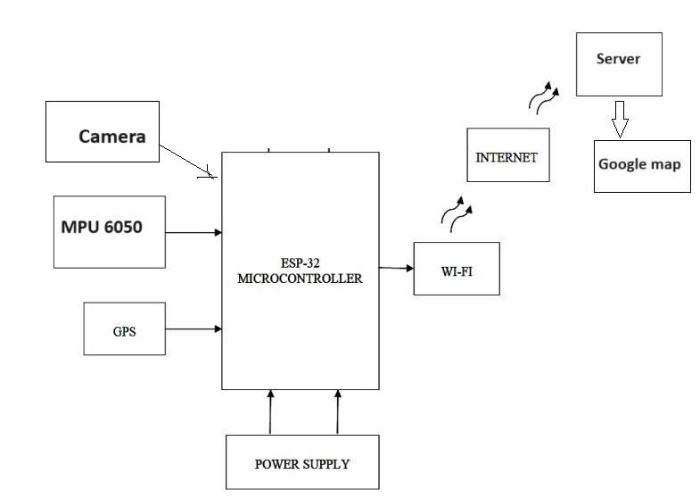

# Smart Road Condition Checker

This project develops an electronic device to identify the road condition, before starting the journey. Using this system, drivers and the other people who visit our country as a tourist can get more benefits. Also, we can save the additional money which is to be paid for inspectors who check the road condition can be reduced. People can save additional time that they spend for roads which are not in a good condition.

This system helps drivers to alert the road condition. This information is made available in the Google map and when we search Google map we will be able to know about the road condition too. Using this system people can identify road condition whether it is a perfect road along which can go without any accident and without any time waste. Here the current situation on the road is automatically identified by the pictures and sensors and that data will be updated to the Google map from the previous vehicles passed through the road. Here there is a device with a camera and sensors that detect width of road and crack points of the road. This device will be mounted on the vehicle.

A mobile application is used to automatically update these data to the Google map. When a vehicle goes through a broken road system will automatically recognize them and update it to Google instantly. Then next vehicle can avoid using that road and can prevent the harm.

Using these system drivers and the other people who visit our country as a tourist can get more benefits using this system. Also we can save the additional money which is to be paid for inspectors who check the road condition. People can save additional time that they spend for traffic. And now the days we can save our fuel too.

Another special purpose is that State and Local maintenance departments are tasked with keeping roads in good repair, which includes monitoring the roads to detect the presence of cracks, potholes, and other distress. Currently, this is done by inspectors, who drive out to each location and record the conditions on paper. This is a tedious and often inconsistent process. Using specialized vehicles outfitted with sensors can automate the data collection process significantly. However, these vehicles are expensive, costing as much as $600,000. Another way of collecting data is through citizen reports, but these are often only about severe and acute problems. In this project, we present a system to monitor the condition of roads on a continuous basis, at low cost, with consistent quality, and with minimal human intervention.

My approach involves using images collected by commodity devices such as sensors to obtain information about the road condition. These devices can mounted in service-vehicles like cabs, garbage trucks, police cars, public vehicle etc. But under the current economic crisis in Sri Lanka I hope to minimize the further cost to develop the system by using a specific vehicle. Which already make regular rounds on city roads for other purposes . With this system the whole street network of a city can be continuously monitored at a much lower initial and operating cost than traditional methods.

## License

This work is licensed under a
[Creative Commons Attribution-NonCommercial-ShareAlike 4.0 International License][cc-by-nc-sa].
[![CC BY-NC-SA 4.0][cc-by-nc-sa-shield]][cc-by-nc-sa]  
[![CC BY-NC-SA 4.0][cc-by-nc-sa-image]][cc-by-nc-sa]

[cc-by-nc-sa]: http://creativecommons.org/licenses/by-nc-sa/4.0/

[cc-by-nc-sa-image]: https://licensebuttons.net/l/by-nc-sa/4.0/88x31.png

[cc-by-nc-sa-shield]: https://img.shields.io/badge/License-CC%20BY--NC--SA%204.0-lightgrey.svg

## Contact Information

For questions or feedback, please contact the author:

- Author: Dilshan M. Karunarathne
- Email: ceo@altier.me
- Website: [http://altier.me](http://altier.me)
